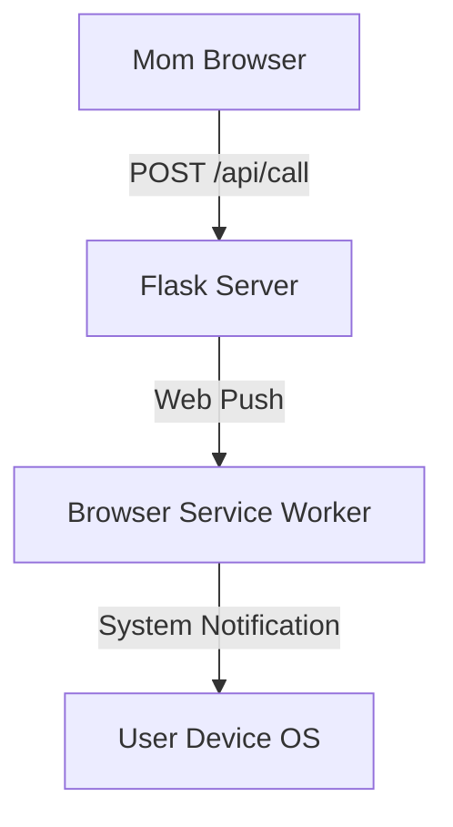
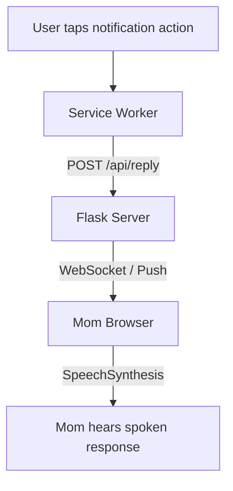
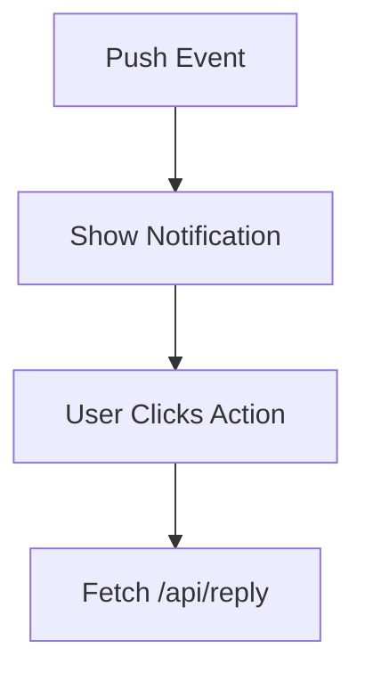

# Technical Plan: For CallBell

🌟 **Summary**

Implement a fully web-based household notification system using **Web Push Notifications** and **Service Workers**. The system allows one user (Mom) to trigger a call request and another user (You) to receive and respond to it **without keeping the web app open**, using native browser notifications with action buttons and text-to-speech feedback.

---

## 🎯 Goals

* No app running in foreground
* No laptop/phone kept open
* Automatic system notifications
* Two-way communication
* Fully standards-compliant web solution

---

## 📊 High-Level Flow Diagrams

### Backend Push Notification Flow



---

### Notification Action & Response Flow



---

## 🧰 Implementation Details

---

## 1. Backend (Flask + Web Push)

### a. Responsibilities

* Store push subscriptions
* Send push notifications
* Receive notification action responses
* Forward responses to Mom’s browser

---

### b. Required Libraries

```bash
pip install flask pywebpush cryptography
```

---

### c. Generate VAPID Keys (One-Time)

```bash
python -m pywebpush generate_vapid_keys
```

These keys authenticate your server to browsers (like SSL, but for notifications).

---

### d. API Endpoints

**File:** `app.py`

```text
POST /api/subscribe     # Save push subscription
POST /api/call          # Trigger notification
POST /api/reply         # Receive response (1, 3, 5 min)
```

---

### e. Push Notification Payload

```json
{
  "title": "📢 Mom is calling",
  "body": "How long until you come?",
  "actions": [
    { "action": "1", "title": "1 min" },
    { "action": "5", "title": "5 min" },
    { "action": "10", "title": "10 min" }
  ]
}
```

---

## 2. Service Worker (Background Logic)

### a. Responsibilities

* Receive push events
* Display system notifications
* Handle notification action clicks
* Send selected response to server

---

### b. Service Worker Flow



---

### c. Service Worker File

**File:** `static/sw.js`

```javascript
self.addEventListener("push", event => {
  const data = event.data.json();
  event.waitUntil(
    self.registration.showNotification(data.title, {
      body: data.body,
      actions: data.actions,
      requireInteraction: true
    })
  );
});

self.addEventListener("notificationclick", event => {
  event.notification.close();
  fetch("/api/reply", {
    method: "POST",
    body: JSON.stringify({ minutes: event.action }),
    headers: { "Content-Type": "application/json" }
  });
});
```

---

## 3. Frontend (Mom’s Browser)

### a. Responsibilities

* Trigger call request
* Speak incoming responses
* Register for push only once

---

### b. One-Time Setup

User visits site once and grants permission:

```javascript
Notification.requestPermission();
navigator.serviceWorker.register("/static/sw.js");
```

After this:

* Browser can receive notifications forever
* Page does not need to stay open

---

### c. Text-to-Speech Response

```javascript
function speak(text) {
  speechSynthesis.speak(new SpeechSynthesisUtterance(text));
}
```

---

## 4. Security & Constraints

* Push notifications require explicit user permission
* Service workers require HTTPS (or localhost)
* Browser vendors strictly enforce these rules

---

## 📦 Deployment Options

* Free cloud hosting (HTTPS included):

  * Render
  * Railway
  * Fly.io

Server must remain online to deliver notifications.

---

## 🧠 Technical Summary

* Service Workers enable background execution
* Web Push API delivers OS-level notifications
* Notification Actions enable instant replies
* SpeechSynthesis API provides spoken feedback
* Flask coordinates subscriptions and messaging
* Works even when no browser tab is open

---

## 🚀 Future Enhancements

* Add vibration feedback
* Add busy / ignore modes
* Multi-user support
* Regional language voices
* Convert to installable PWA

---

This plan follows modern web standards, respects security boundaries, and solves the problem cleanly and scalably.
